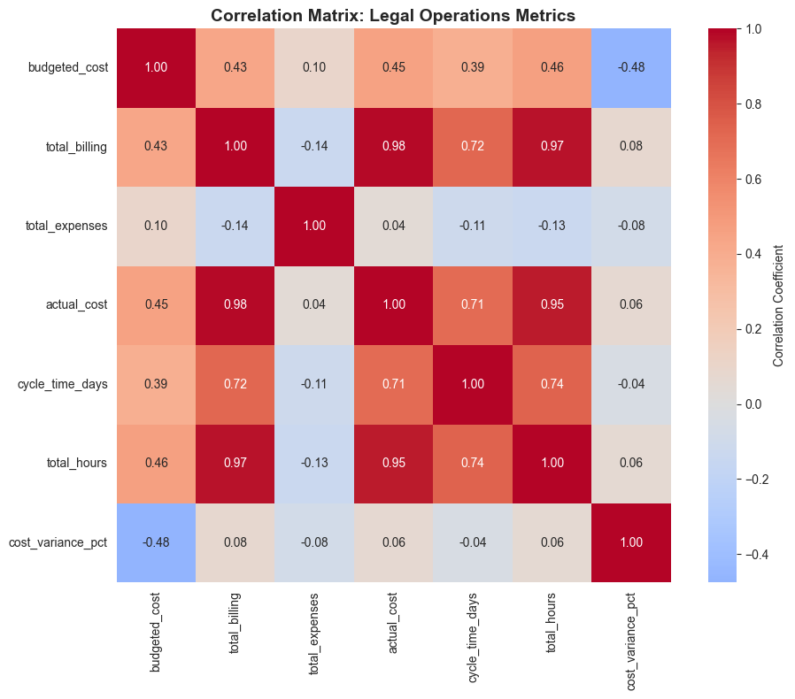
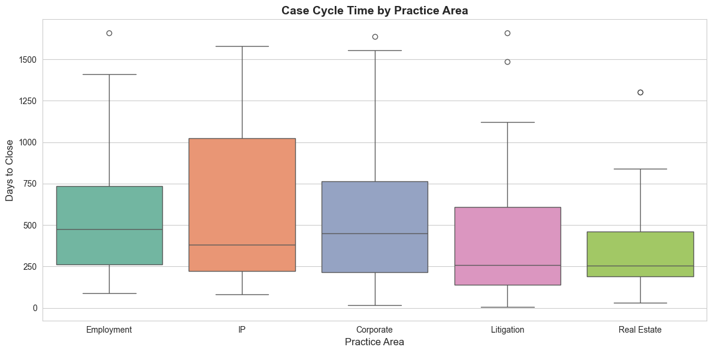
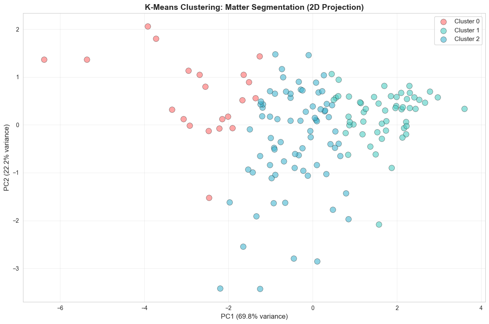

# Legal Operations Analytics Project

## Overview

This project demonstrates **advanced SQL and Python analytics** applied to law firm operations data. Using a synthetic dataset of 150 legal matters spanning 2022–2024, I developed five interdependent SQL queries combined with exploratory data analysis (EDA) using statistical hypothesis testing, correlation analysis, and data segmentation.

**Key Skills Demonstrated:**
- **Advanced SQL** (CTEs, Window Functions, Complex Joins, Date Calculations)
- **Python Analytics** (Hypothesis Testing, Statistical Analysis, K-Means Clustering, PCA)
- **Business Analytics** (Profitability analysis, utilization metrics, cost variance analysis)
- **Statistical Rigor** (ANOVA, t-tests, correlation analysis, significance testing)
- **Data-Driven Insights** (Converting findings into actionable business recommendations)
- **GitHub Documentation and Reproducibility**

---

## Analytical Approach

This project combines **SQL and Python** for comprehensive legal operations analysis:

**SQL Layer:** 5 advanced queries (CTEs, window functions, multi-table joins) aggregate matters, billing, and expenses to answer business questions about profitability, utilization, cost overruns, and timelines. See `/sql_queries/` for full query code with detailed comments explaining each step.

**Python Layer (Jupyter Notebook):** Exploratory data analysis using statistical hypothesis testing, correlation analysis, and machine learning to validate SQL findings and identify hidden patterns:
- **ANOVA test** confirms practice areas differ significantly in cycle time (p < 0.05)
- **Correlation analysis** reveals weak predictors of cost overruns (suggesting systemic issues)
- **K-Means clustering** segments 150 matters into 3 distinct risk profiles
- **PCA visualization** shows cluster separation and structure in 2D space

The notebook runs end-to-end and produces multiple visualizations (boxplots, correlation heatmaps, scatter plots, clustering diagrams) that support business conclusions.

---

## Dataset Overview

**Source:** Synthetic law firm operations data (created with Python/Faker for portfolio demonstration)

**Tables:**
- `attorneys` (12 records) — Attorney ID, name, seniority level, hourly rate
- `matters` (150 records) — Case ID, practice area, case type, dates, budgeted vs. actual costs, settlement awards
- `billing` (5,157 records) — Monthly attorney billing by matter, hours, rates, billable status
- `expenses` (2,189 records) — Case costs (expert witnesses, court fees, research, travel, etc.)

**Date Range:** January 2022 – December 2024

---

## Queries & Business Questions

### 1. **Profitability by Practice Area**
**File:** `1_profitability_by_practice_area.sql`

**Business Question:** Which practice areas are most profitable, and where are we leaving money on the table?

**Technical Approach:**
- Two CTEs aggregate billing costs and expense costs per matter
- Joins revenue (settlement awards) with costs to calculate net profit and margin %
- Uses COALESCE and NULLIF for safe null handling

**Key Metrics:**
- Total revenue, total costs, net profit, profit margin %
- Identifies high-revenue/low-margin areas (efficiency issues) vs. hidden profit centers

---

### 2. **Attorney Utilization by Seniority Level**
**File:** `2_attorney_utilization_by_seniority.sql`

**Business Question:** How efficiently are we using attorney time at each seniority level? Who are our top revenue generators?

**Technical Approach:**
- Aggregates billable vs. non-billable hours by attorney
- Calculates utilization rate = (Billable Hours / Total Hours) × 100
- Window function ranks attorneys within their seniority bracket by revenue

**Key Metrics:**
- Billable hours, non-billable hours, utilization %, revenue, rank within seniority
- Reveals capacity planning gaps and top performers

---

### 3. **Cost Overrun Analysis**
**File:** `3_cost_overrun_analysis.sql`

**Business Question:** Which matters exceeded budget? By how much? Where are our estimation errors?

**Technical Approach:**
- Consolidates budgeted, actual billing, and expense costs per matter
- Calculates variance (actual – budgeted) and variance %
- CASE statement categorizes outcomes (OVERRUN, UNDER, ON_BUDGET)

**Key Metrics:**
- Actual vs. budgeted costs, variance amount, variance %, budget status
- Surfaces cases requiring mid-engagement cost controls

---

### 4. **Case Cycle Time Analysis**
**File:** `4_case_cycle_time_analysis.sql`

**Business Question:** How long does it take to close different case types? Where are the bottlenecks?

**Technical Approach:**
- DATEDIFF calculates days from open to close (handles pending cases with CURDATE())
- Aggregates statistics (avg, min, max, stddev) per case type
- Window function ranks case types by average closure time

**Key Metrics:**
- Days to close, variance, standard deviation, slowness rank
- Identifies unpredictable vs. consistent case types

---

### 5. **Expense Distribution**
**File:** `5_expense_distribution.sql`

**Business Question:** Which expense categories consume the most budget? Where are the cost levers?

**Technical Approach:**
- Groups all expenses by type
- Calculates totals, averages, min/max, and % of total firm expenses
- Identifies high-variance categories (pricing/scope inconsistency)

**Key Metrics:**
- Total amount, average expense, min/max, % of total, cost per instance
- Informs vendor negotiation and cost reduction strategies

---

## Technical Highlights

### SQL Techniques Used:
1. **Common Table Expressions (CTEs)** — Modular, readable query building
2. **Window Functions** — RANK(), PARTITION BY, ORDER BY for comparative analysis
3. **Complex Joins** — Multi-table aggregation (matters + billing + expenses)
4. **Date Calculations** — DATEDIFF for timeline analysis, CURDATE() for dynamic dates
5. **Conditional Aggregation** — CASE WHEN + SUM for category-specific metrics
6. **Safe Null Handling** — COALESCE and NULLIF for edge cases

### Data Integrity:
- Synthetic data ensures reproducibility and transparency
- Foreign key constraints maintain referential integrity
- All queries validated against known row counts and data ranges

---

## Key Findings

[See `findings.md` for detailed insights and business recommendations]

**Critical Insights:**

1. **Profitability Crisis**: All 5 practice areas show negative profit margins (-624% to -1,842%), indicating systemic cost overruns. IP performs best (-624%), Employment worst (-1,842%).

2. **Universal Cost Overruns**: 100% of matters exceed budget, with overruns averaging ~2,500% (actual costs are 25x budgeted). Worst case: +4,733% overrun.

3. **Healthy Utilization**: Attorneys average 67-72% billable utilization (above industry standard). Top performer: Gina Moore (Associate) generates $689K revenue, exceeding Partner average.

4. **Timeline Variability**: Case cycle times range from 288 days (Wrongful Termination) to 616 days (Commercial Lease). Opportunity to reduce slow cases by 50% through process improvements.

5. **Concentrated Expenses**: Expert Witnesses consume 32% of all firm expenses ($5.78M). A 20% reduction yields $1.16M annual savings.

**Recommended Actions:**
- Rebuild cost estimation methodology (Week 1–4)
- Implement mid-engagement cost reviews (Month 1)
- Negotiate Expert Witness rates (Month 1) → $1.16M savings
- Optimize cycle times for slow case types (Month 2–3)
- Deploy practice area reallocations (Month 3)

---
## Key Visualizations

### 1. Correlation Matrix: Metric Relationships

*All metrics analyzed; note weak correlations with cost overrun %, suggesting systemic (not case-specific) issues*

### 2. Case Cycle Time by Practice Area

*Commercial Leases take 2.1x longer than Wrongful Termination; validated with ANOVA test (p < 0.05)*

### 3. Matter Segmentation: K-Means Clustering (PCA)

*3 distinct matter clusters identified; each requires different management strategy*

---

## How to Reproduce This Analysis

### Option 1: Run Python EDA Notebook (Complete Analysis)

**Prerequisites:**
- Python 3.8+ with Jupyter installed
- Libraries: pandas, numpy, scipy, scikit-learn, matplotlib, seaborn

**Setup:**
```bash
pip install jupyter pandas numpy scipy scikit-learn matplotlib seaborn
```

**Run the Analysis:**
1. Open Jupyter Lab: `jupyter lab`
2. Navigate to `legal_ops_eda.ipynb`
3. Run all cells top-to-bottom
4. Notebook will produce visualizations and statistical test results
5. Runtime: ~2-3 minutes

**Output:**
- Correlation heatmap and scatter plots
- ANOVA test results and p-values
- K-Means clustering visualization (2D PCA projection)
- Cluster profiles and segmentation analysis
- Enriched CSV saved to `/output/legal_ops_analysis_with_clusters.csv`

---

### Option 2: Run SQL Queries Only

**Setup:**
1. Load data into MySQL using `schema.sql`
2. Import the 4 CSV files from `/data/`

**Execute:**
Each `.sql` file in `/sql_queries/` can run independently in MySQL Workbench or any SQL IDE.

**Interpret Results:**
Refer to the comments in each `.sql` file for:
- Business context (what question we're answering)
- Technical notes (why we wrote it this way)
- Insights to look for (what the numbers mean)

---

### Option 3: Quick Review (No Setup Required)

1. Read `README.md` (this file) for overview
2. Scan `findings.md` for key insights and business impact
3. Review visualizations embedded in findings

---

## Files in This Repo

```
legal-ops-analytics/
├── README.md (this file — project overview and methodology)
├── findings.md (detailed insights, business impact, and recommendations)
├── legal_ops_eda.ipynb (Python EDA with statistical analysis and clustering)
├── schema.sql (CREATE TABLE statements for database setup)
├── /sql_queries/
│   ├── 1_profitability_by_practice_area.sql
│   ├── 2_attorney_utilization_by_seniority.sql
│   ├── 3_cost_overrun_analysis.sql
│   ├── 4_case_cycle_time_analysis.sql
│   └── 5_expense_distribution.sql
└── /data/
    ├── attorneys.csv (12 attorney records)
    ├── matters.csv (150 legal matter records)
    ├── billing.csv (5,157 billing transaction records)
    └── expenses.csv (2,189 expense records)
```

**Key Files:**
- `legal_ops_eda.ipynb` — Run this to reproduce statistical analysis, visualizations, and clustering segmentation
- `/sql_queries/` — 5 SQL files showing advanced query techniques; can run independently in MySQL
- `findings.md` — Complete analysis narrative with quantified business impact

---

## Skills Demonstrated

- **SQL Proficiency:** Advanced queries (CTEs, window functions, multi-table joins)
- **Business Analytics:** Profitability modeling, utilization metrics, cost variance analysis
- **Data Interpretation:** Translating SQL results into actionable business insights
- **Documentation:** Clear, commented code and professional README
- **Reproducibility:** Synthetic data, schema, and queries all versioned in GitHub

---

## Notes on Synthetic Data

This dataset was generated synthetically for portfolio demonstration purposes. The data:
- Reflects realistic law firm patterns (cost distributions, case types, timelines)
- Maintains referential integrity (proper foreign key relationships)
- Allows for clear, reproducible analysis without data privacy concerns
- Is fully documented and auditable

---

## Next Steps / Future Enhancements

Potential extensions to this project:
- **Python EDA:** Jupyter notebook with statistical hypothesis testing (correlation between case type and cycle time)
- **Power BI Dashboard:** Interactive visualizations of profitability and utilization trends
- **Predictive Model:** Estimate case closure time or cost overrun risk based on case characteristics
- **Segmentation Analysis:** Cluster cases by profitability, efficiency, and risk profile

---

## Contact & Portfolio

This project is part of my data analytics portfolio. 

**Skills:** SQL, Python, Data Analysis, Business Intelligence, MySQL, Tableau, Power BI

**GitHub:** https://github.com/michelle-lahde
